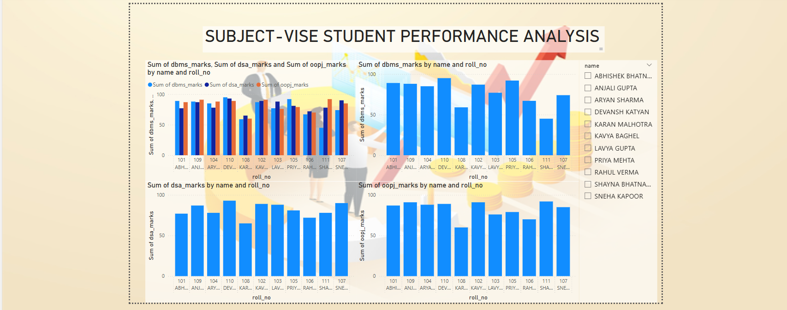

# 🎓 Student Marks Management & Performance Analysis System

A Python-based academic record management system that integrates database management and data analytics to provide real-time student performance insights.

## 📖 Overview

This project was developed as part of a summer training program to demonstrate the integration of Python, MySQL, and Power BI in a real-world academic management workflow.

The system allows users to perform CRUD (Create, Read, Update, Delete) operations on student records through a Python application built using Object-Oriented Programming principles. Student data is stored in a MySQL database, which is connected to Power BI for performance analysis and visualization.

Any changes made through the Python application are reflected in the database and can be analyzed through the Power BI dashboard.

---

## ✨ Key Features

* Student record management system
* Create, update, delete, and view student records
* MySQL database integration
* Object-Oriented Programming implementation
* Power BI performance dashboard
* Dynamic data-driven analysis
* Subject-wise student performance tracking

---

## 🛠️ Tech Stack

**Programming Language**

* Python

**Libraries**

* Pandas
* SQLAlchemy
* MySQL Connector

**Database**

* MySQL

**Visualization**

* Power BI

**Concepts**

* Object-Oriented Programming (OOP)
* CRUD Operations
* Database Connectivity
* Data Analytics

---

<h2>📊 Dashboard Preview</h2>

  

---

## 🔄 Project Workflow

Python Application → MySQL Database → Power BI Dashboard

The Python application manages student records and updates the database. Power BI connects to the database and provides visual insights into student performance, allowing users to monitor academic results through interactive dashboards.

---

## 📚 Learning Outcomes

Through this project, I gained practical experience in:

* Database design and management
* Python-MySQL integration
* SQLAlchemy usage
* Object-Oriented Programming
* Dashboard development using Power BI
* End-to-end data management workflows

---

## 🚀 Future Enhancements

* Graphical User Interface (GUI)
* User authentication system
* Report generation
* Attendance management module
* Web-based deployment

---

## 👨‍💻 Author

**Abhishek Bhatnagar**

BCA Student | Data Science Enthusiast

Focused on building practical projects in Data Science, Analytics, and Machine Learning.
